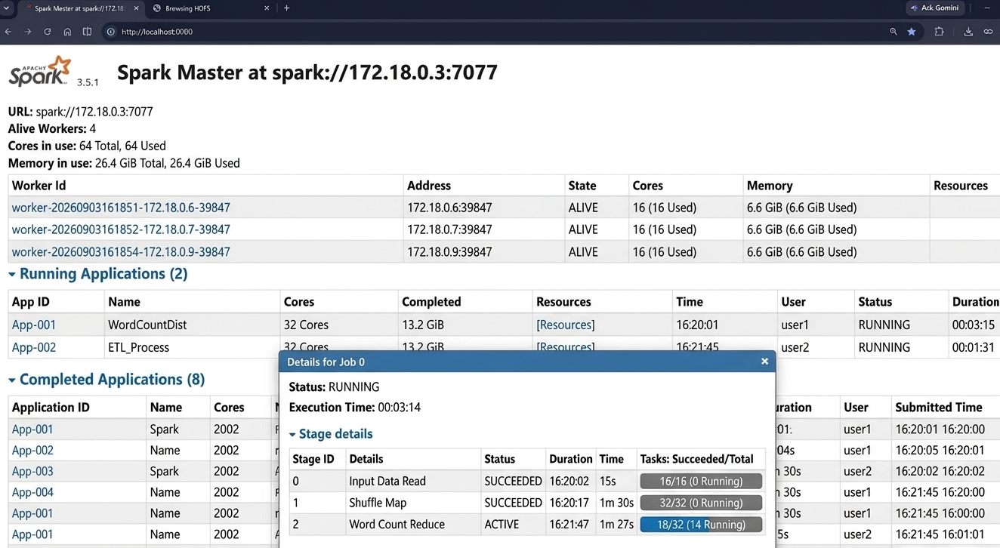
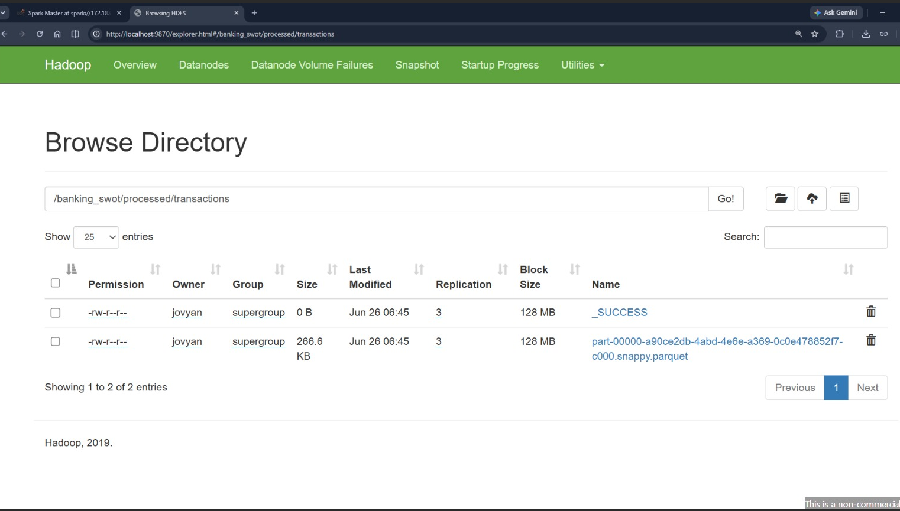

# Big Data SWOT Analytics Pipeline for Retail Banking

A scalable Big Data analytics pipeline for Retail Banking that combines internal banking data with external market sentiment to generate actionable SWOT insights for management decision-making.

The project demonstrates how HDFS, Apache Spark, Apache Hive, and HBase work together in a distributed analytics architecture.

## Project Overview

The pipeline integrates:

- Internal banking data for **Strengths and Weaknesses**
- External market sentiment for **Opportunities and Threats**
- Combined analytics for **SWOT synthesis and management reporting**

The architecture is designed to demonstrate scalable Big Data processing rather than represent a production-scale banking workload.

## Objectives

- Store raw and processed banking data using HDFS
- Clean and transform data using Apache Spark
- Perform batch analytics using Apache Hive
- Support fast point lookups using HBase
- Validate data quality
- Analyze external market sentiment
- Generate SWOT insights
- Apply performance optimization techniques

## Datasets

| Dataset | Rows | Description |
|---|---:|---|
| `customer_data.csv` | 10,000 | Customer profiles and regional information |
| `transaction_data.csv` | 10,000 | Banking transactions and account activity |
| `bank_data.csv` | 1,000 | Branch revenue, expenses, and profitability |
| `external_bank_sentiment.csv` | 300 | Competitor sentiment, topics, engagement, and market information |

**Internal records:** 21,000  
**External sentiment records:** 300  
**Total records:** 21,300

## Architecture

```text
                         Retail Banking Data
                                  |
                 +----------------+----------------+
                 |                                 |
           Internal Data                     External Data
                 |                                 |
                HDFS                              HDFS
                 |                                 |
               Spark                             Spark
                 |                                 |
          Cleaning & ETL                  Sentiment Processing
                 |                                 |
               Hive                              HBase
                 |                                 |
       Strength / Weakness              Opportunity / Threat
                 |                                 |
                 +----------------+----------------+
                                  |
                           SWOT Synthesis
                                  |
                         Management Report
```

### Pipeline Flow

**Internal:** Raw Banking Data → HDFS → Spark Cleaning & ETL → Hive Analytics → Strength / Weakness

**External:** Market Sentiment → HDFS → Spark Processing → HBase / Hive → Opportunity / Threat

**Final:** Internal + External Insights → SWOT Synthesis → Management Reporting

## Technology Stack

| Technology | Role |
|---|---|
| **HDFS** | Distributed storage for raw, processed, and curated data |
| **Apache Spark** | ETL, cleaning, transformation, sentiment processing, and SWOT synthesis |
| **Apache Hive** | Batch SQL analytics and BI queries |
| **HBase** | Low-latency point lookups |
| **Parquet** | Optimized columnar storage |
| **Docker** | Containerized Big Data environment |

## HDFS Storage Strategy

```text
/banking_swot/
├── raw/
│   ├── internal/
│   │   ├── customer/
│   │   ├── transaction/
│   │   └── branch/
│   └── external/
│       └── sentiment/
├── processed/
│   ├── internal/
│   │   ├── customer_clean/
│   │   ├── transaction_clean/
│   │   └── branch_clean/
│   └── external/
│       └── sentiment_clean/
└── curated/
    └── hive/
        ├── fact_transaction/
        ├── dim_customer/
        ├── dim_branch/
        └── fact_external_sentiment/
```

Raw files are preserved for auditability, while processed data is stored in Parquet for efficient analytical processing.

## Spark Data Processing

Apache Spark performs data cleaning, transformation, sentiment classification, and SWOT synthesis.

### Customer Data
- Remove duplicate `Customer_ID`
- Standardize region and city fields
- Flag missing `Age` and `Customer_Type`

### Transaction Data
- Remove duplicate `Transaction_ID`
- Remove invalid transaction amounts
- Parse dates
- Prepare account-type aggregations

### Branch Data
- Remove duplicate `Branch_ID`
- Validate revenue and expense fields
- Calculate regional profitability

### External Sentiment
- Remove duplicate posts
- Clean topic and text fields
- Classify sentiment as Positive, Negative, or Neutral
- Map sentiment to SWOT signals:
  - Positive → Opportunity
  - Negative → Threat
  - Neutral → Monitor

```python
sentiment_label = (
    when(col("sentiment_score") >= 0.25, "Positive")
    .when(col("sentiment_score") <= -0.25, "Negative")
    .otherwise("Neutral")
)
```

## Data Quality Validation

| Dataset | Raw Rows | Missing Values | Clean Rows |
|---|---:|---|---:|
| Customer | 10,000 | Age: 500; Customer_Type: 500 | 10,000 |
| Transaction | 10,000 | None | 10,000 |
| Branch | 1,000 | Firm_Revenue: 50 | 1,000 |
| External Sentiment | 300 | None | 300 |

External sentiment classification:

- Positive: **135**
- Negative: **113**
- Neutral: **52**

## Hive Data Warehouse

The internal warehouse follows a simple **Star Schema**.

**Fact tables**
- `fact_transaction`
- `fact_external_sentiment`

**Dimension tables**
- `dim_customer`
- `dim_branch`

Hive supports batch analytical queries involving joins, grouping, aggregation, regional analysis, transaction performance, branch profitability, and SWOT reporting.

## HBase Real-Time Access

HBase is used for fast point lookups rather than complex analytical aggregation.

### `customer_profile`

Row key:

```text
customer_id
```

### `competitor_sentiment`

Composite row key:

```text
competitor_bank#region#post_date#post_id
```

Example queries:

```text
get 'customer_profile', '207501'

get 'competitor_sentiment',
'HDFC Bank#North#2024-01-05#1'

scan 'competitor_sentiment', {LIMIT => 5}
```

## SWOT Analytics

### Strength
**North** was identified as the strongest region by total transaction value.

- Total transaction value: **6,496,515.48**
- Transaction count: **2,556**

### Weakness
**South** was identified as the clearest internal weakness.

- Total transaction value: **6,121,454.30**
- Transaction count: **2,407**

### Opportunity
**Branch Waiting Time** showed a strong positive market signal.

- Positive posts: **21**
- Average sentiment: **0.64**
- Total engagement: **19,941**

Other opportunity topics included Digital Banking, Investment Products, Loan Promotion, and Mobile App.

### Threat
**Customer Service** was identified as the largest threat topic.

- Negative posts: **18**
- Average sentiment: **-0.51**
- Total engagement: **18,557**

Other threat topics included Investment Products, Mobile App, Online Security, and Branch Waiting Time.

## Business Processes

### Transaction Performance Analysis
Analyzes transaction values by region and account type.

**Technology:** Hive

### Branch Performance Analysis
Analyzes branch profitability and regional performance.

**Technology:** Hive + Spark

### Competitor Monitoring
Provides fast access to competitor, region, date, and topic information.

**Technology:** HBase

### Market Sentiment Monitoring
Analyzes sentiment and engagement by topic.

**Technology:** Spark + Hive

## Performance Optimization

### Hive
- Parquet storage
- Partitioning by sentiment label
- Partitioning transactions by month
- Reduced scan size for repeated reports

### Spark
- Cache `sentiment_clean` for repeated SWOT aggregations
- Broadcast small customer and branch dimensions when appropriate
- Reduce shuffle cost

### HBase
- Composite row keys
- Row Bloom filters
- Pre-splitting for high-volume competitor prefixes
- Optional TTL for short-lived alerts

## Big Data 4Vs

### Volume
The internal sample contains 21,000 records, while real-world banking systems can generate millions of transactions and market events. The architecture demonstrates scalability beyond the sample dataset.

### Velocity
Banking reports can run as daily batch jobs, while market sentiment and competitor signals may require more frequent monitoring.

### Variety
The project combines structured banking data with text-based market sentiment, topics, competitor information, and engagement metrics.

### Veracity
The datasets contain missing values and potentially noisy external sentiment, requiring cleaning and validation before analytics.

## Environment Evidence

### Apache Spark Cluster



The screenshot shows the running Spark Master and Worker environment.

### HDFS



The screenshot shows processed banking data stored in the HDFS project structure.

## Repository Structure

```text
Retail-Banking-Data-Warehouse-/
├── Data/
├── Big Data SWOT Analytics Pipeline for Retail Banking.pdf
├── ETL_Data_Transformation.ipynb
├── HDFS.png
├── Spark.png
└── README.md
```

## Project Report

The complete report covers:

- Case study and business justification
- Big Data 4Vs
- System architecture
- HDFS storage strategy
- HBase schema design
- Hive data warehouse
- Spark processing
- ETL implementation
- Data quality checks
- Hive SWOT queries
- HBase real-time queries
- Spark SWOT synthesis
- Performance optimization
- Architecture trade-offs
- Challenges and solutions

[View the complete project report](Big%20Data%20SWOT%20Analytics%20Pipeline%20for%20Retail%20Banking.pdf)

## Notebook

[ETL_Data_Transformation.ipynb](ETL_Data_Transformation.ipynb)

## Key Business Insight

The final SWOT synthesis combines internal operational performance with external market sentiment so management can evaluate internal performance and market conditions in one decision-support view.

## Conclusion

This project demonstrates a complete Big Data analytics workflow for Retail Banking:

```text
Data Ingestion
      ↓
HDFS Distributed Storage
      ↓
Spark Cleaning & Transformation
      ↓
Hive Batch Analytics + HBase Real-Time Lookup
      ↓
SWOT Synthesis
      ↓
Management Insights
```

The project demonstrates practical use of distributed storage, ETL, analytical SQL, real-time lookup, data quality validation, sentiment processing, and performance optimization.

## Technologies

`HDFS` · `Apache Spark` · `Apache Hive` · `HBase` · `Parquet` · `Docker` · `Python` · `SQL` · `ETL` · `Data Cleaning` · `Sentiment Analysis` · `Big Data Analytics` · `SWOT Analysis`
